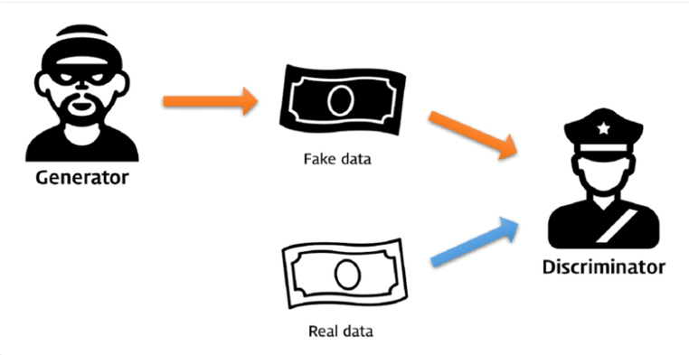
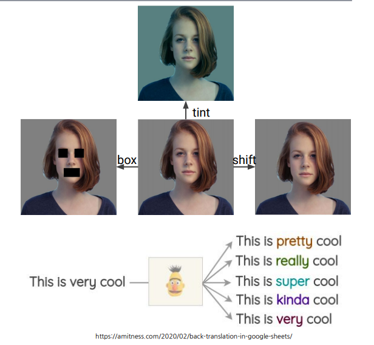

블로그를 매일 일기처럼 쓰고 매일 배운걸 빼곡히 요점정리 하는 것보다

특별히 기억나거나 중요한거 위주로 내용을 정리해보려고 합니다.

# Generative Adversarial Networks

같은 팀원이 발표한건데 어렵긴 하지만 흥미롭게 알게 된것이 있어 몇가지 정리하고자 합니다.

<a>https://arxiv.org/abs/1406.2661</a>

위 논문을 짧게 요약하자면 GAN 이라는 프레임워크를 소개하는 것이다.

Generative Model과 Discriminative Model 이라는 서브 모델이 있는데 G는 데이터를 학습해서 fake 데이터를 생성하고 D는 이를 real 데이터인지 판별하는 모델이다.

서로 모델을 경쟁시켜 G는 D가 구분하기 힘들게 정교한 fake data를 만들고 G는 D가 생성한 fake 데이터와 real 데이터를 더 잘 구별하려 노력한다.

데이터를 구별하는 확률이 50%까지 수렴하도록 학습시키는 것이 목적이다.

발표해준 팀원은 자세히 더 잘 설명해주었는데 본인의 학업의 성취가 낮아 아직 다 이해하지 못해서 그 이상은 적기 힘들것 같다...

일단 서브모델 두 개를 서로 경쟁시킨다는 개념이 신기하였다. 

아직까진 레이블을 통한 지도학습밖에 이해가 되질 않는데 모델끼리 경쟁을 붙여 성능을 증가시키는 프레임워크가 있다는게...

먼 훗날에는 이에 대해서도 자세히 배울 수 있으면 좋겠다.

#Data Augmentation

모델을 학습 시킬 데이터의 수가 부족할 때, 이미지를 변형시켜서 억지로 데이터 수를 늘리는 것이다.

이미지를 tint, box, shift 하여 이미지를 바꾸거나 "This is very cool"을 같은 의미인 "This is pretty cool" 등으로 바꾸는 것이 있다.

그 외에도 이미지를 축을 기준으로 반전시키거나(Horizontal Flips) 이미지를 일부만 잘라내는 것도 있다.(Random Crops)

이미지 크기와는 상관없이 물체를 인식해야 되기 때문에 사용하기도 한다.

토네이도 예측 모델 같은 경우는 데이터 셋이 적기 때문에 이와 같은 방법을 사용한다고 배웠다.

CV를 함에 있어서 이러한 방법을 많이 사용한다고 하니 더 잘 숙지해야겠다.
