# ViViT 논문 리뷰

수업듣느라 바쁘고 예비군 갔다오느라 바빠서 오랜만에 올리네요...

그 사이에 제가 진행했던 논문리뷰를 올리고자 합니다.

지금 진행하는 ViT 모델과도 연관이 있으니 괜찮을 것 같습니다.

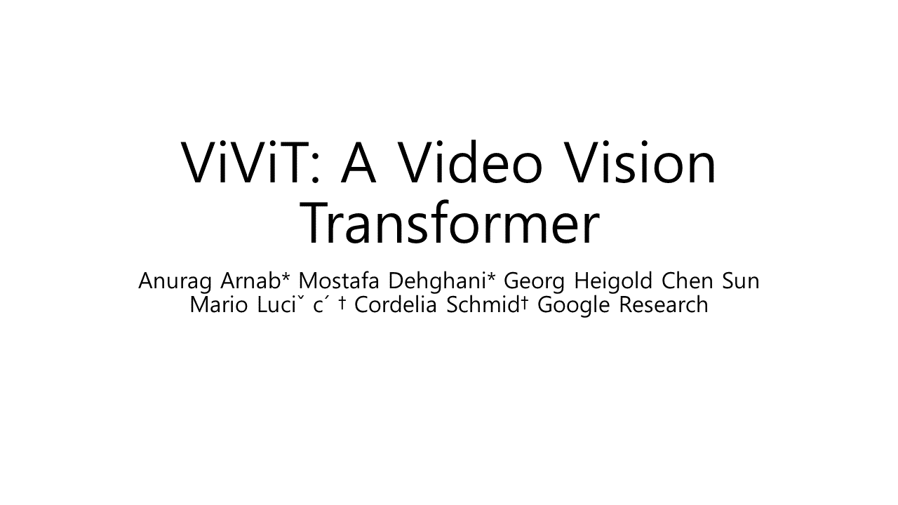
제가 진행한 논문 발표는 ViViT Transformer 모델입니다.

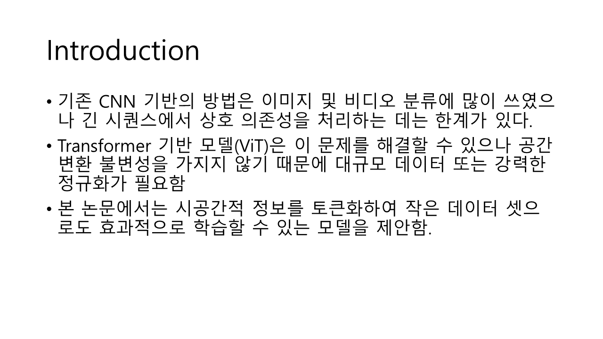
우선 본 논문을 짧게 설명하자면 CNN 모델이 이미지 및 비디오 분류에는 탁월하나 긴 시퀀스를 처리하는 것은 한계가 있으니 Transformer구조의 모델로 이를 해결하고자 한 것 입니다.

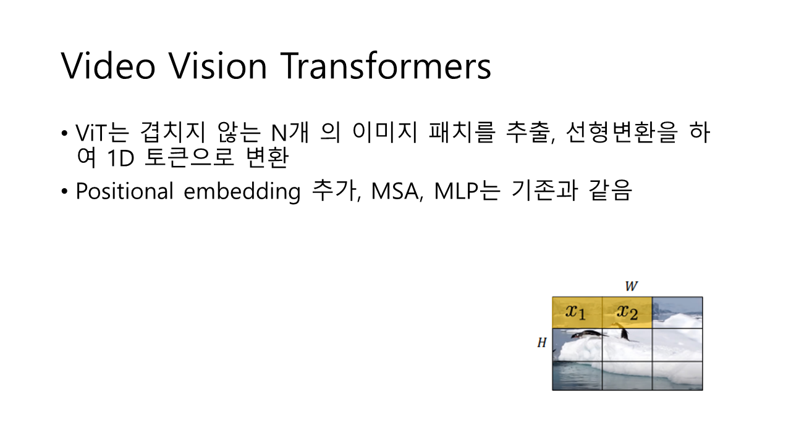
기존의 ViT를 설명하자면 이미지를 여러개의 패치로 나누고 이를 선형변환한 뒤 하나의 토큰으로 변환하여 positional embedding을 추가합니다.

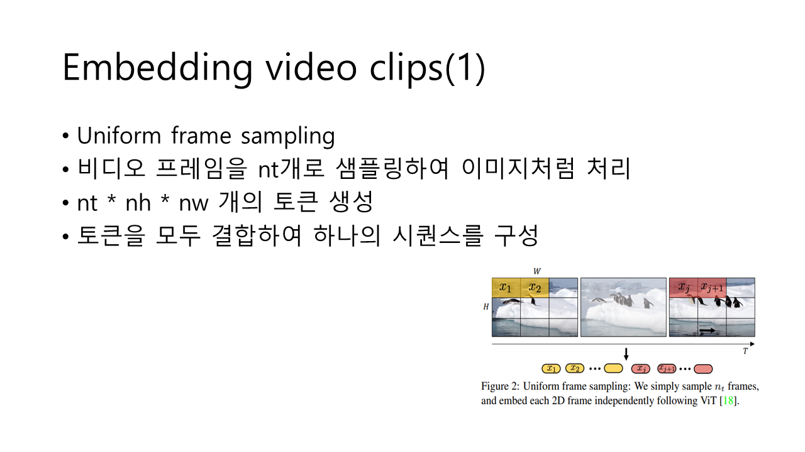
균일 프레임 샘플링 (Uniform Frame Sampling) 방법은 비디오 데이터를 처리하는 데 있어 효과적인 접근법입니다. 이 방식은 비디오 클립을 일정한 간격으로 샘플링하여 프레임을 추출하고, 각 프레임을 독립적으로 처리한 다음, 이들을 통합하여 트랜스포머 모델에 입력하는 방식입니다.

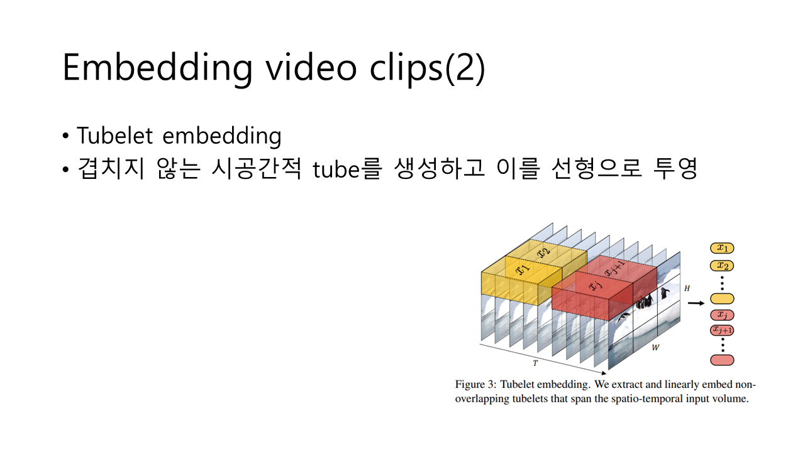
**튜블렛(Tubelet)**은 3차원 구조를 갖추고 있으며, 비디오 데이터를 공간적 및 시간적 정보를 동시에 포함하는 3D 영역으로 정의됩니다. 튜블렛 임베딩(Tubelet Embedding)은 비디오의 이러한 3차원 정보를 활용하여, 비디오 클립의 공간적 및 시간적 특징을 동시에 처리할 수 있습니다.

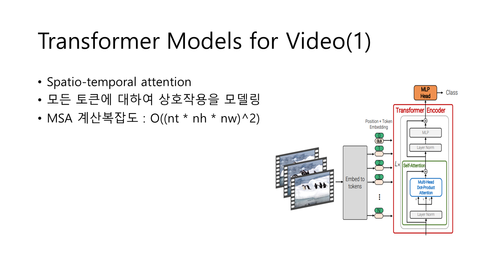
Model 1: Spatio-temporal Attention
설명: 이 모델은 비디오에서 추출된 모든 시공간 토큰을 트랜스포머 인코더에 직접 입력합니다.
작동 방식: ViT(Vision Transformer)를 비디오 데이터에 적용한 것으로, 모든 시공간 토큰 간의 상호작용을 모델링합니다.
장점: 각 트랜스포머 레이어에서 모든 토큰 간의 관계를 한 번에 모델링하므로, 비디오의 전체 시공간 상호작용을 초기 단계부터 포착할 수 있습니다.
단점: 이 접근 방식은 모든 토큰 간의 상호작용을 계산하므로, 토큰 수에 비례해 계산 복잡도가 급격히 증가합니다. 특히, 비디오에서는 프레임 수가 많아질수록 계산 복잡도가 크게 증가합니다.

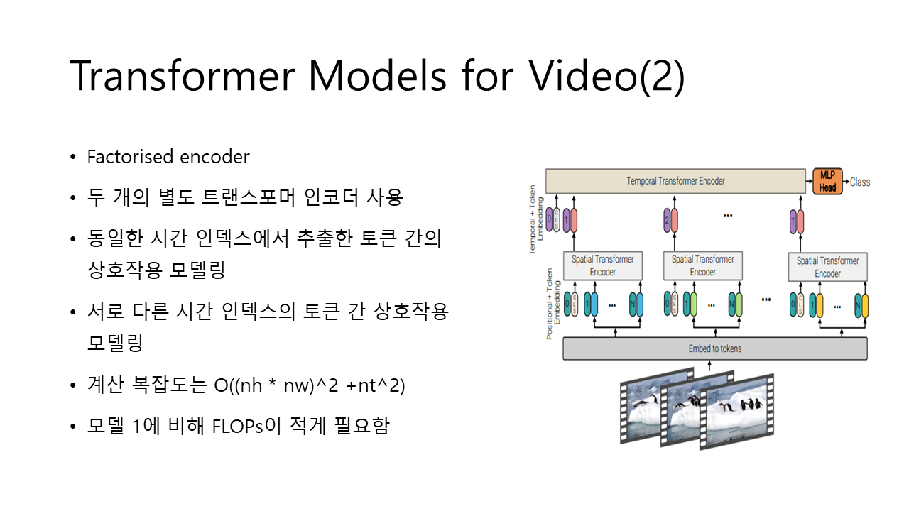
Model 2: Factorised Encoder
설명: 이 모델은 두 개의 트랜스포머 인코더로 구성되어 있으며, 첫 번째 인코더는 공간적 관계를, 두 번째 인코더는 시간적 관계를 모델링합니다.
작동 방식:
Spatial Encoder: 비디오의 각 프레임에서 공간적 토큰 간의 상호작용을 모델링하여, 각 시간 인덱스에 대한 공간적 표현을 생성합니다.
Temporal Encoder: 이후에 생성된 각 시간 인덱스의 공간적 표현을 사용해 시간적 상호작용을 모델링합니다.
장점: 공간적 및 시간적 정보가 순차적으로 처리되므로 계산 복잡도가 감소합니다. CNN 기반의 이미지 분류 모델들과 유사한 방식으로 공간적 특징을 먼저 추출하고, 이를 시간적으로 통합합니다.
단점: 모델의 층 수가 많아지므로 매개변수 수는 증가하지만, 계산 복잡도는 Model 1에 비해 더 효율적입니다.

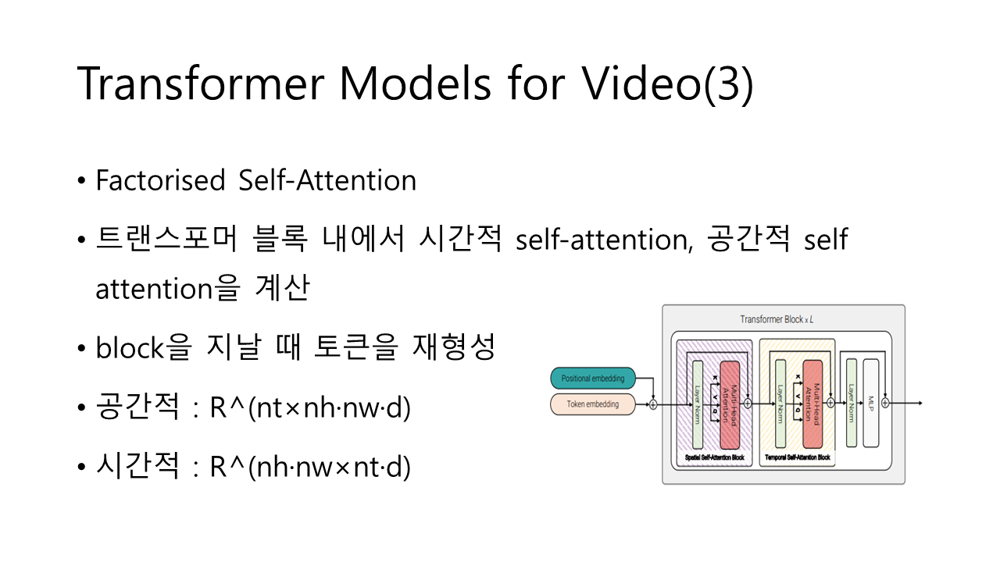
Model 3: Factorised Self-Attention
설명: 이 모델은 트랜스포머의 각 레이어에서 시공간 토큰 간의 상호작용을 분리하여 처리합니다.
작동 방식:
Spatial Self-Attention: 먼저, 동일한 시간 인덱스에서 공간적 토큰 간의 상호작용을 모델링합니다.
Temporal Self-Attention: 그다음, 동일한 공간 인덱스에서 시간적 토큰 간의 상호작용을 모델링합니다.
장점: Model 1과 동일한 트랜스포머 층 수를 유지하면서도, 계산 복잡도는 Model 2와 비슷한 수준으로 줄일 수 있습니다. 각 레이어에서 시공간 토큰 간의 상호작용을 분리하여 처리함으로써, 보다 효율적인 연산이 가능합니다.
단점: 각 레이어의 계산을 두 단계로 나누어 처리하기 때문에, 매개변수 수가 Model 1에 비해 증가할 수 있습니다.

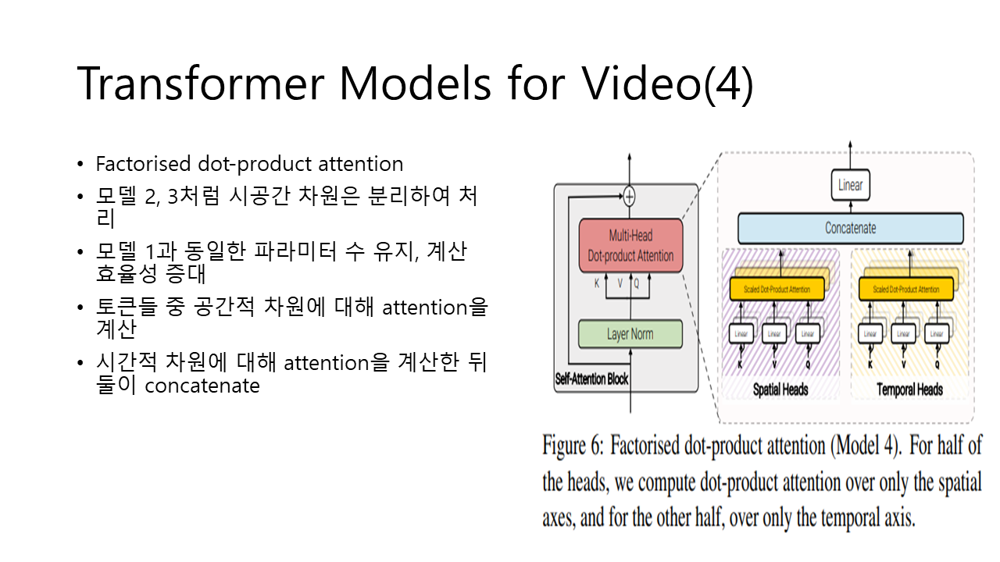
Model 4: Factorised Dot-Product Attention
설명: 이 모델은 Model 3과 유사하지만, 주의(attention) 연산에서 공간적 및 시간적 차원을 명시적으로 분리하여 처리합니다.
작동 방식:
Spatial Heads: 일부 주의 헤드에서는 공간적 차원에서만 토큰 간 상호작용을 계산합니다.
Temporal Heads: 나머지 주의 헤드에서는 시간적 차원에서만 상호작용을 계산합니다.
결합: 두 차원에서 계산된 결과를 결합하여 최종 출력을 만듭니다.
장점: Model 1과 동일한 매개변수 수를 유지하면서도, 계산 복잡도를 Model 2 및 Model 3과 유사하게 줄일 수 있습니다.
단점: 주의 연산을 공간적 및 시간적 차원으로 분리하기 때문에, 설계와 구현이 복잡할 수 있습니다.

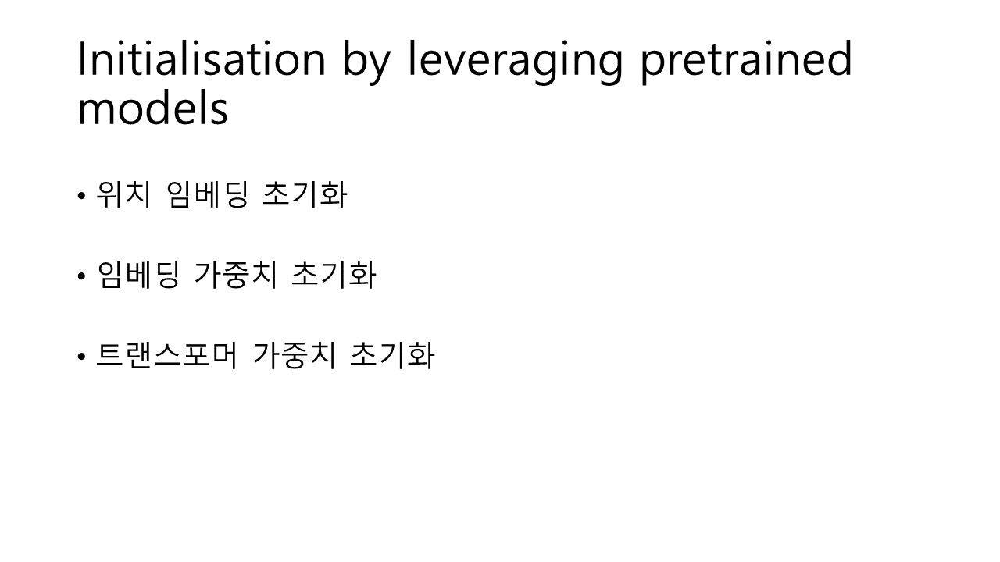
1. 위치 임베딩 초기화
비디오 모델은 이미지 모델보다 많은 토큰을 가지고 있기 때문에, 위치 임베딩을 반복하여 더 많은 토큰에 맞추어 초기화합니다. 초기화 시 모든 동일한 공간 인덱스의 토큰은 같은 임베딩 값을 가지며, 이후 훈련을 통해 이 임베딩이 조정됩니다.
2. 임베딩 가중치 초기화
"튜블렛 임베딩"에서 3D 컨볼루션 필터를 초기화할 때, 필터를 시간 차원에 따라 복제하고 평균화하거나, 특정 프레임(중앙 프레임)에서만 임베딩 필터를 사용하여 초기화합니다. 이는 비디오에서 여러 프레임을 처리할 수 있도록 모델이 훈련되는 동안 시간을 통합할 수 있게 합니다.
3. 트랜스포머 가중치 초기화
모델 3의 경우, 두 개의 MSA 모듈이 포함되어 있습니다. 공간 MSA는 사전 훈련된 모델의 가중치를 사용하고, 시간 MSA는 초기화 시 가중치를 0으로 설정하여 모델이 훈련 초기에 잔여 연결처럼 작동하도록 합니다. 이는 모델이 훈련을 통해 시간 정보를 학습할 수 있도록 합니다.

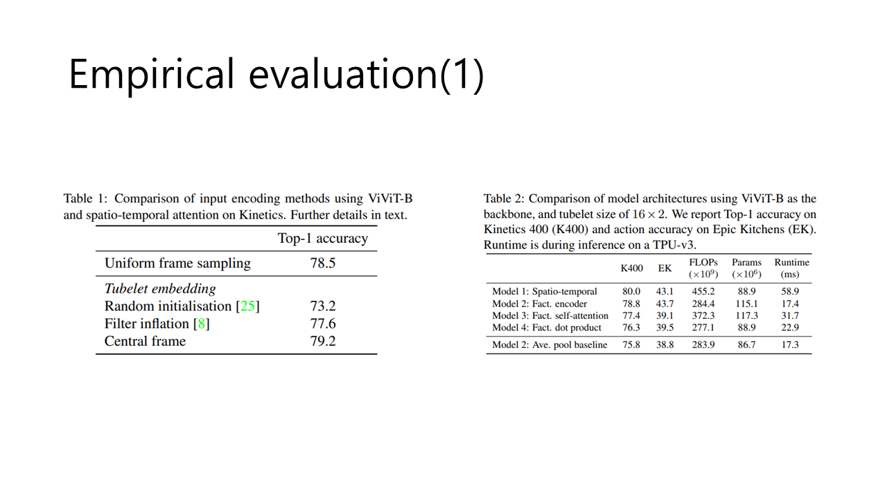
입력 인코딩
우리는 다양한 입력 인코딩 방법의 효과를 검토합니다 (Sec. 3.2). ViViT-B를 사용한 비인자화 모델(Model 1)을 Kinetics 400 데이터셋에서 평가합니다. 32프레임 입력을 네트워크에 전달할 때, 8프레임을 샘플링하고 길이 t=4t = 4t=4인 튜블렛을 추출하는 경우 두 방법 모두 같은 수의 토큰을 생성합니다. 표 1에서는 “중앙 프레임” 방법으로 초기화된 튜블렛 임베딩이 좋은 성능을 보여주며, 일반적으로 사용되는 “필터 팽창” 초기화 방법 [8, 22]보다 1.6%, “균일 프레임 샘플링”보다 0.7% 높은 정확도를 기록합니다. 따라서 모든 후속 실험에서는 이 인코딩 방법을 사용합니다.

모델 변형
제안하는 모델 변형들을 Kinetics 400과 Epic Kitchens 데이터셋에서 정확도와 효율성 측면에서 비교합니다 (Sec. 3.3). 모든 경우에 “Base” 백본과 16 × 2 튜블렛 크기를 사용합니다. Model 2 (“Factorised Encoder”)는 추가적인 하이퍼파라미터인 시간 변환기 수 LtL_tLt​를 가지고 있습니다. 실험에서는 Lt=4L_t = 4Lt​=4로 설정했으며, 표 3에서는 모델이 이 선택에 민감하지 않음을 보여줍니다.
비인자화 모델 (Model 1)은 Kinetics 400에서 가장 좋은 성능을 보입니다. 그러나 Epic Kitchens과 같은 작은 데이터셋에서는 과적합될 수 있습니다. Epic Kitchens에서는 “Factorised Encoder” (Model 2)가 가장 좋은 성능을 보입니다. 또한, Model 2를 기반으로 하는 추가 기준선 (마지막 행)은 시간 변환기를 사용하지 않고 공간 인코더에서 프레임 수준 표현을 평균 풀링하여 분류합니다. 이 평균 풀링 기준선은 가장 낮은 성능을 보이며, Epic Kitchens에서 정확도가 크게 떨어지는 것을 나타냅니다. 이는 이 데이터셋이 시간적 관계를 더 세밀하게 모델링해야 함을 시사합니다.
모든 인자화된 모델 변형은 비인자화 모델 (Model 1)보다 훨씬 적은 FLOPs를 요구합니다. Model 4는 비인자화 Model 1에 추가 파라미터가 없으며, 가장 적은 연산을 사용합니다. Model 2의 시간 변환기 인코더는 ntn_tnt​ 토큰만을 처리하므로, 평균 풀링 기준선에 비해 연산과 런타임에 큰 변화가 없지만 정확도가 크게 향상됩니다 (Kinetics에서 3%, Epic Kitchens에서 4.9% 향상). 마지막으로, Model 3은 추가적인 자기 주의 블록으로 인해 다른 인자화 모델들보다 더 많은 연산과 파라미터를 요구합니다.

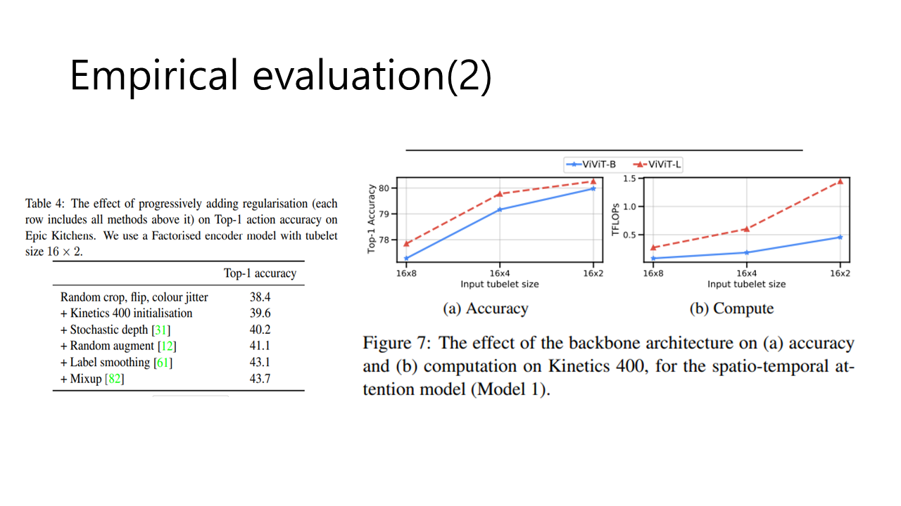
모델 정규화
순수 변환기 아키텍처 (예: ViT [18])는 큰 훈련 데이터셋을 요구하며, Epic Kitchens 및 SSv2와 같은 작은 데이터셋에서는 과적합이 관찰됩니다. 이러한 데이터셋에서 효과적으로 모델을 훈련하기 위해, 우리는 여러 정규화 전략을 사용했습니다 (표 4). 이 정규화 방법들은 본래 CNN 훈련을 위해 제안되었지만, 최근 ViT 이미지 분류를 위해 탐색되었습니다 [64].
표 4에서 각 행은 위의 행들에 포함된 모든 방법을 포함하며, 각 정규화 방법을 추가하면서 점진적인 성능 개선을 관찰할 수 있습니다. Epic Kitchens에서는 전체적으로 5.3%의 개선이 있으며, SSv2에서도 5%의 개선을 달성했습니다. Kinetics와 Moments in Time과 같은 대형 데이터셋에서는 추가 정규화를 사용하지 않아도 최신 상태의 결과를 얻을 수 있었습니다. 이는 표 2의 Kinetics-사전 훈련 모델을 기반으로 하며, 표 2의 Epic Kitchens 모델은 모든 정규화를 적용하여 훈련되었습니다.

백본 변경
그림 7은 ViViT-B와 ViViT-L 백본을 비교합니다. 백본 용량이 증가함에 따라 정확도가 일관되게 향상되며, 예상대로 연산량도 증가합니다.

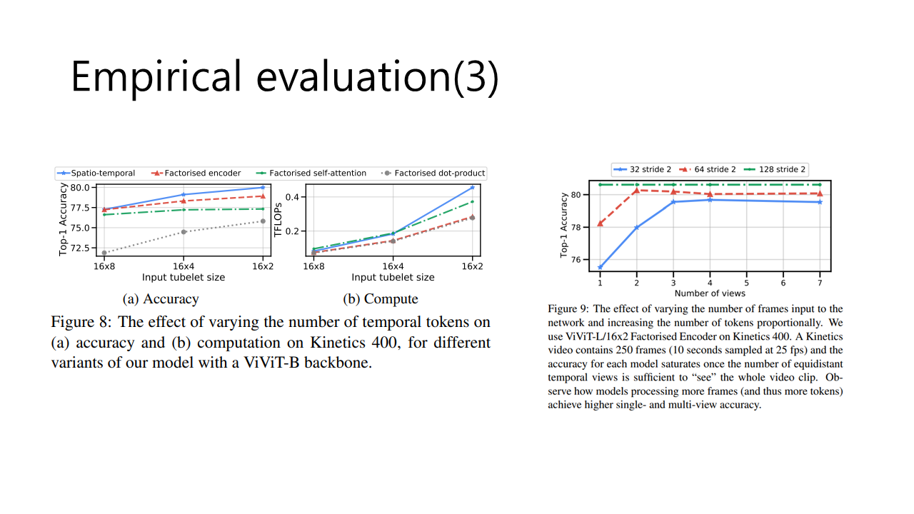
토큰 수 변경
그림 8은 시간 차원에서 토큰 수에 따른 성능을 분석합니다. 입력 튜블렛 크기가 작아질수록 (즉, 더 많은 토큰) 모든 모델 아키텍처에서 일관된 정확도 향상을 보입니다. 동시에, FLOPs 측면에서 연산량도 증가하며, 비인자화 모델 (Model 1)이 가장 큰 영향을 받습니다.

입력 프레임 수 변경
우리는 현재까지 입력 프레임 수를 32로 고정해왔습니다. 이제 프레임 수를 증가시켜 모델에 입력된 토큰 수를 비례적으로 증가시킵니다. 그림 9는 입력 프레임 수를 늘릴 때 정확도가 증가함을 보여줍니다. 그러나 일반적으로 Kinetics와 같은 데이터셋에서는 여러 짧은 “뷰”에서 결과를 평균화하는 것이 관행입니다. 그림 9는 모델이 더 많은 프레임을 처리할수록 더 높은 단일 및 다중 뷰 정확도를 달성함을 보여줍니다.

ViViT-L/16x2 Factorised Encoder를 사용한 이 실험에서, Model 2는 더 많은 프레임을 처리할 수 있어 메모리 부족 문제 없이 더 높은 정확도를 달성합니다. 더 많은 프레임을 처리할수록 (즉, 더 많은 토큰) 일관되게 높은 정확도를 달성하며, Model 1보다 적은 총 FLOPs로 더 높은 정확도를 달성할 수 있습니다. Model 2는 입력 프레임 수에 따라 FLOPs가 선형적으로 증가하며, 전체 연산은 초기 Spatial Transformer에 의해 지배됩니다. 따라서, 최대 정확도를 달성하는 데 필요한 총 FLOPs는 모델에 관계없이 일정합니다.

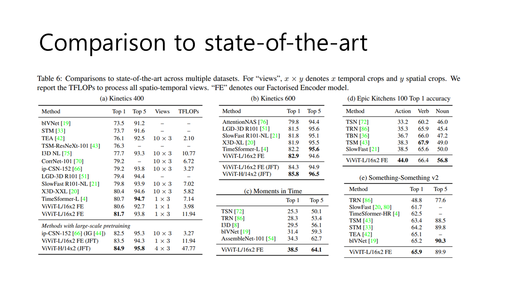
Kinetics
Kinetics 400과 600에서의 성능: 표 6a와 6b에 따르면, 우리의 시공간 어텐션 모델이 Kinetics 400과 600에서 최신 기술을 능가합니다. 일반적인 관행에 따라, 각 시간적 뷰에 대해 3개의 공간적 크롭(왼쪽, 중앙, 오른쪽)을 사용합니다. 특히, 이전의 CNN 기반 방법들보다 훨씬 적은 수의 뷰를 사용하여 더 나은 성능을 달성합니다.
최신 기술 비교: ViViT-L/16x2 Factorised Encoder(FE)를 ImageNet에서 미리 학습한 후, 이전의 CNN 기반 최신 기술을 초월하였고, 동시에 순수 트랜스포머 아키텍처를 제안한 [4]보다도 우수한 성과를 보였습니다. 또한, 더 큰 JFT 데이터셋에서 미리 학습된 백본을 사용함으로써 추가적인 개선을 이루었습니다. JFT에서 미리 학습된 ViViT-H 백본을 사용하는 우리의 최상의 모델은 Kinetics 400과 600에서 각각 84.9%와 85.8%의 최고 기록을 달성했습니다.
Moments in Time
성능: 표 6c에서 보듯이, 우리의 모델은 Moments in Time 데이터셋에서 현저히 높은 성능을 기록했습니다. 이 데이터셋의 비디오는 다양하고 레이블 노이즈가 많아 다른 데이터셋보다 정확도가 낮습니다.
Epic Kitchens 100
성능: 표 6d에 따르면, 우리의 Factorised Encoder 모델이 이전 방법들보다 현저히 높은 성능을 보입니다. 특히, “명사” 클래스의 Top-1 정확도가 크게 향상되었으며, “동사” 정확도가 더 높은 유일한 방법은 추가적인 입력 모달리티로 광학 흐름을 사용했습니다 [43, 50]. 또한, 표 2의 모든 모델 변형이 액션 정확도에서 기존의 최신 기술을 초과했습니다. 우리는 동일한 모델을 사용하여 두 개의 별도 “헤드”로 동사와 명사를 예측하며, 각 헤드에 대해 별도의 손실 가중치를 사용하지 않았습니다.
Something-Something v2 (SSv2)
성능: 표 6e에 따르면, Factorised Encoder 모델(Model 2)을 사용하여 SSv2에서 최고의 Top-1 정확도를 달성했습니다. 하지만 이전 방법들에 비해 상대적으로 작은 차이로 성과를 보였습니다. 특히, 우리의 Factorised Encoder 모델은 순수 트랜스포머 모델을 제안한 TimeSformer [4] 방법보다 2.9% 더 우수합니다. SSv2는 배경과 객체가 클래스 간에 매우 유사하여 세밀한 모션 패턴을 인식하는 것이 중요합니다. 우리의 결과는 이러한 세밀한 모션을 포착하는 것이 개선이 필요하고 미래의 작업 과제가 될 수 있음을 시사합니다. 또한, SSv2와 Kinetics에서의 이전 방법들의 상대적인 성과는 모델의 상이한 특성을 평가한다는 것을 나타냅니다.

