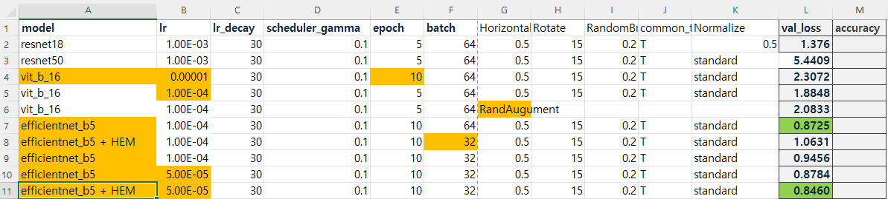

# Sketch image Classification

이번에 처음 서버를 할당받아 프로젝트를 진행하였습니다.

ssh 를 이용하여 서버를 사용하는 것도 처음이였고 고성능 모델등을 사용하는 것도 처음이라 설정하는데 애를 많이 먹었습니다;;

아무래도 처음 진행하는 프로젝트여서 중구난방으로 진행된것이 많았습니다.

팀원들이 각자 develop을 하고 실험하거나 성능이 좋은 부분을 공유하기로 했는데

제가 능숙하지 못하여 저는 모델 개선에 도움을 많이 못줬었습니다.

이번에 느낀거는 learning rate의 조절이 굉장히 중요하다는것을 깨달았습니다.

모델마다 적절한 lr 값이 다르고 schedular 를 통한 decay도 중요하다는 것을 새삼 다시 깨달았습니다.

위 사진이 제가 개인적으로 작성한 실험 관리중 일부입니다.

# Hard Example Mining

제가 적용해본 학습 기법입니다.

# 문제 정의

---

- validation 에서 classification 에 실패하는 이미지들을 확인해보니 같은 이미지들에 대해서 추론을 실패하는 경향을 보임.
- 이에 예측에 실패하는 샘플에 대해서 높은 비중으로 학습을 진행한다면 더 높은 성능을 이끌어 낼 수 있다는 가정을 세움.

epoch1 에서 추론에 실패한 9개의 예시 :

Sketch_image_classfication/image_classification.png

epoch5 에서 추론에 실패한 9개의 예시 :

Sketch_image_classfication/image_classification.png

# Hard Example Mining

---

- 모델이 학습 과정에서 잘못 예측하거나 어려운 샘플에 대해 집중적으로 학습하는 방법.
- 특히 데이터가 많은 경우, 쉬운 샘플보다 모델이 어려움을 겪는 사례에 집중함으로써 학습 효율성을 높일 수 있음.

# Test

---

- 빠른 학습을 위해 Resnet18 모델 사용
- 기존 baseline code 에서 train_epoch만 수정
- loss가 큰 샘플 k개에 대해서 만 backward 를 수행

<pre>
  <code>
    def apply_hem(self):
        # 모든 샘플에 대한 손실 계산
        self.model.eval()
        losses = []
        images, targets = [], []
        
        with torch.no_grad():
            for batch_images, batch_targets in self.train_loader:
                batch_images, batch_targets = batch_images.to(self.device), batch_targets.to(self.device)
                outputs = self.model(batch_images)
                loss = self.loss_fn(outputs, batch_targets)
                losses.append(loss.item())  # 손실을 스칼라로 저장
                images.append(batch_images.cpu())
                targets.append(batch_targets.cpu())

        # 손실에 따라 샘플 정렬
        losses = np.array(losses)  # 이제 리스트를 배열로 변환
        images = torch.cat(images)
        targets = torch.cat(targets)

        # 손실의 내림차순으로 정렬
        sorted_indices = np.argsort(losses)[::-1]
        
        # 상위 k 샘플 선택
        top_k_indices = sorted_indices[:self.k]
        top_k_images = images[top_k_indices]
        top_k_targets = targets[top_k_indices]

        # 선택된 샘플로 모델 업데이트
        self.optimizer.zero_grad()
        outputs = self.model(top_k_images.to(self.device))
        loss = self.loss_fn(outputs, top_k_targets.to(self.device))
        loss.backward()
        self.optimizer.step()
  </code>
</pre>

# 결과

---

- 같은 조건의 모델보다 val_loss가 조금 줄어들은 것을 확인 할 수 있었습니다
- 그러나 직접 test를 돌려보지 못해 정확한 지표를 알기 어려웠습니다.
- lr 를 더 잘 조정한다면 더 성능이 잘 나올것으로 사료됌.
