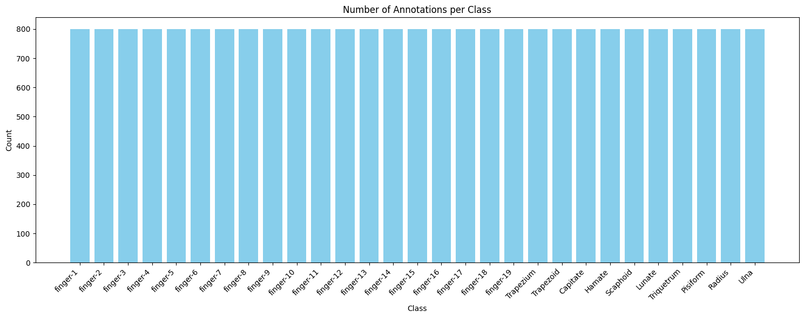
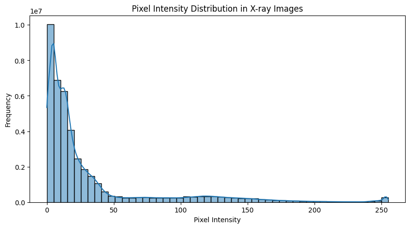
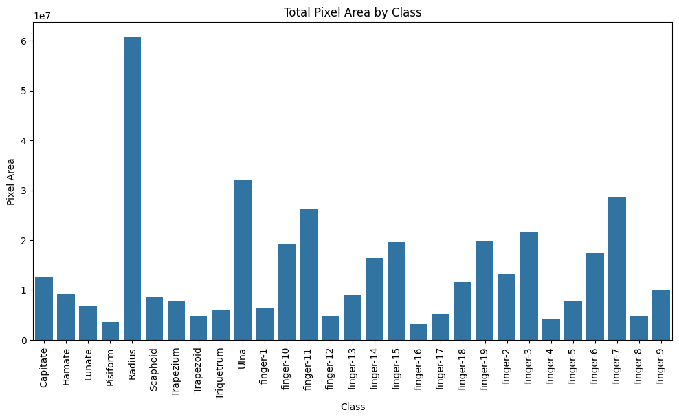
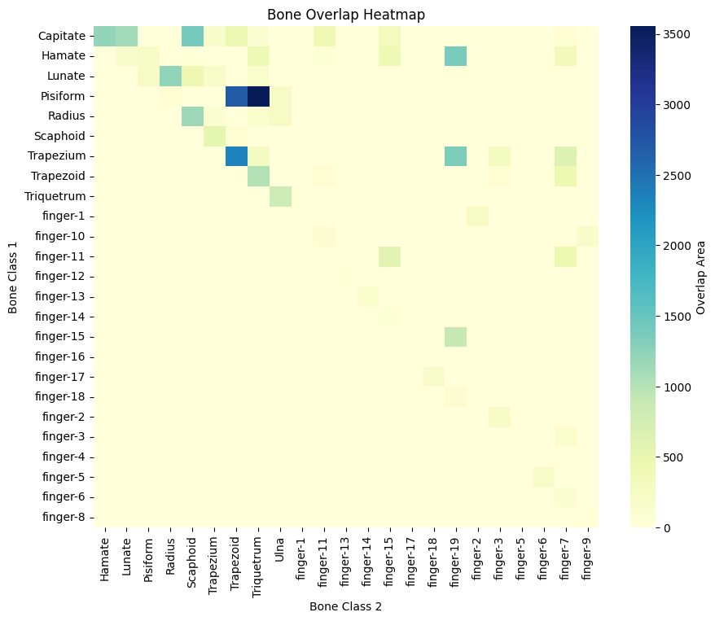
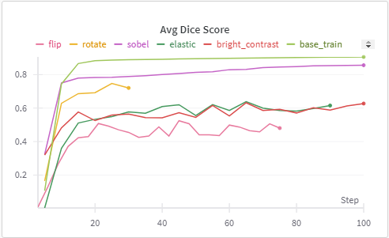

# Hand Bone Image Segmentation
본 프로젝트는 한 쌍의 손 X-ray 이미지에 대해 각각의 뼈들을 클래스 별로 구분하는 task 입니다.
모델은 각 클래스(29개)에 대한 확률 맵을 갖는 멀티채널 예측을 수행하고, 이를 기반으로 각 픽셀을 해당 클래스에 할당합니다.
최종적으로 예측된 결과를 Run-Length Encoding(RLE) 형식으로 변환하여 csv 파일로 제출합니다.

---

## EDA
저는 이번에 데이터 분석 및 증강기법 실험을 진행하였습니다.

팀원과 같이 EDA 를 진행하여 제가 진행한 EDA만 소개하겠습니다.

### Class 개수 통계


Data를 처음 눈으로 확인 하면서 800개의 Data 모두가 29개의 Class를 정확히 가지고
있을것이라고 가정했습니다. 또한 의료용 X-Ray Hand Bone Image라는 점에서 Dirty
Data의 가능성은 낮을 것이라고 판단했습니다.
클래스 별 분포를 확인하고, Miss Label을 파악하기 위해 통계를 냈더니 전부 800개로
같았습니다.

### Inference 와 Ground Truth 비교
![image]
<의료 데이터셋은 개인정보보호법, 생명윤리법 등에 따라 엄격한 관리가 요구되고 있습니다.>

베이스 모델이 어느 부분을 잘 추론하지 못하는지 확인하기 위해 Inference 결과와
Ground Truth를 겹쳐서 비교하였습니다. Inference 결과와 GT 를 비교하였을때 주로
겹치는 뼈, multi label 을 모델이 잘 추론하지 못한다는 것을 확인하였습니다.
뼈 중앙 부분은 잘 추론해냈지만 경계 부분에서 조금 차이가 있는 것을
확인했습니다. 또한 주로 loss 는 뼈끼리 겹쳐진 부분이나 경계선 부분에서 생긴다는
것을 확인했습니다.

### 이미지 Intensity EDA
![image]
<의료 데이터셋은 개인정보보호법, 생명윤리법 등에 따라 엄격한 관리가 요구되고 있습니다.>

데이터가 X-ray 이미지이기에 Intensity를 통해 픽셀의 분포를 분석하고자 하였다.
샘플이미지 10개에 대해서 이미지 상의 가장 어두운 부분은 0, 가장 밝은 부분은 255로
두고 분포를 그래프로 나타낸것입니다.
바탕이 검정색인 X-ray 이미지라 어두운 부분, 0이 가장 많고 그 외 뼈와 살 부분은 밝은
부분으로 나오는 것을 알 수 있습니다.이를 통한 전처리나 증강기법을 사용하면
경계선 부분은 효과적으로 잡아내지 않을까 기대됩니다.



### Class 별 뼈 면적 Pixel 수와 비율


평가지표는 Dice Score이기에 각 클래스 별 픽셀수를 확인해 보고자 하였습니다.
팔에 해당하는 뼈 (Radius, Ulna) 가 가장 큰 면적을 지녔고 그 다음으로는 손가락
뼈(finger-n)가 큰 면적을 차지하였고 손목 쪽 뼈들(pisiform, trapezoid 등)이 작은 면적을
지닌 것을 확인하였습니다.
평가 지표는 Mean Dice Score 로 계산하기에 픽셀 면적이 작은 뼈들을 잘 추론해내는게
중요하다고 생각하게 됐습니다.

### 겹치는 뼈의 면적


본 데이터에서는 한 픽셀이 Multi label 을 가지는 특징을 가지고 있습니다.
한 이미지에 대해서 여러개의 뼈가 서로 어느정도 겹치는지 알아보고자 Heat Map
으로 시각화하였습니다.두 개의 뼈에 대해 겹치는 픽셀 면적을 계산하고 그 정도가
높을 수록 푸르게 시각화하였습니다. 결과적으로, pisiform 과 Trapezium 이 가장 많이
겹쳐져 있었습니다.

|Class Combination |Count|
|-----------------|-----|
|(Hamate, finger-15, finger-19) |61180|
|(Capitate, Lunate, Scaphoid) |47761
|(Trapezium, Trapezoid, finger-7) |41166|
|(Capitate, Hamate, finger-15) |25097|
|(Capitate, finger-11, finger-15) |23300|
|(Lunate, Radius, Scaphoid) |14188|
|(Hamate, Pisiform, Triquetrum) |13780|
|… |…|

3개가 겹치는 면적도 상당하다는 것을 확인하였고 면적이 대단히 크진 않지만 4개의
클래스가 겹치는 부분도 있다는 것을 확인하였습니다.

### EDA 결론
- Class Imbalance 가 존재하지 않아 검증 데이터는 무작위로 뽑아도 무방하다 생각했습니다.
- loss 는 주로 클래스끼리 겹치는 부분과 경계선 부분에서 발생하였고 이를 모델이 잘 학습한다면 높은 성능을 기대해볼만 할 것 같습니다.
- 데이터의 양이 적어 적절한 증강 방법을 찾아야겠다고 생각하였습니다.

## Augmentation
### 증강 종류
![image]
<의료 데이터셋은 개인정보보호법, 생명윤리법 등에 따라 엄격한 관리가 요구되고 있습니다.>

● CenterCrop: 손목 부위의 겹쳐진 뼈를 더 잘 강조하기 위해 중심부만 선택적으로
확대합니다.
● GaussianNoise / Blur: Noise 와 Blur 를 이용하여 노이즈를 추가, 혹은 제거하여
구분하기 어려운 픽셀도 추론할 수 있는 힘을 기르고자 하였습니다.
● RandomContrast, RandomBrightnessContrast: X-ray 이미지에서 뼈의 구조적 경계를 더
뚜렷하게 하기 위해 대비를 조절합니다.
● CLAHE: 이미지의 밝기 분포가 균등하지 않기에 국소적으로 대비를 조정하여 디테일을
강조시키고자 하였습니다.
● Rotate: 손목의 뼈는 다양한 각도로 회전시켜서 방향성에 대한 편향을 줄입니다.
● ShiftScaleRotate: Rotate에 추가적으로 이미지를 이동시키고 크기를 조정하여 더
다양한 증강을 학습시켰습니다.
● Flip: 왼손을 Flip 하면 오른손과는 일치하지는 않는 증강 기법이라 판단하여 이 또한
학습에 도움이 될 것이라 판단하여 학습시켰습니다.
● Soble Filter: 이미지의 기울기를 계산한뒤 경계를 강조하여 해당 이미지를
학습시킵니다.

### 아쉬운점


증강기법을 적용한 것이 모두 성능이 좋지 못하였습니다.
증강을 적용하지 않은 기본 모델에 비해 성능이 큰 폭으로 하락하였습니다.
성능하락 원인을 찾고자 팀원들과 계속 노력하였었습니다.

### 성능하락 원인
```python
        if self.transforms is not None:
            inputs = (
                {"image": image, "mask": label} if self.is_train else {"image": image}
            )
            result = self.transforms(**inputs)

            image = result["image"]
            label = result["mask"] if self.is_train else label
```
위 코드는 validation 코드 중 일부입니다.
validation 이미지에 대해서는 transform 을 진행하지만 label 에 대해서는 transform 을 진행하지 않아
rotate, flip 과 같은 geometric transform 이 발생한다면 그 차이가 더 심해져 비 이상적인 validatoin score 가 나왔던 것입니다.

또한 train 데이터와 test 데이터 분포 경향이 너무 유사하여 증강이 효과가 없었던게 아닐까 생각합니다.
의료 데이터 특성상 많은 데이터가 주어지지 않고 리더보드의 점수가 우선시 되다 보니 약간의 과적합을 기대하는 task 라 증강이 별 의미가 없었던 것 같습니다.

## 결론
이전 프로젝트에서는 데이터에 대한 이해없이 모델 실험만 진행하였었습니다.
그러나 데이터를 이해하고 모델 실험을 진행하다보니 조금 더 넓은 시야에서 다양한 실험을 진행할 수 있게 된 것 같습니다.
증강에서 직접적인 성능 향상을 이뤄내지 못하여 아쉽지만 일반화가 중요한 다른 프로젝트에서는 힘을 발휘할 수 있지 않을까 싶습니다.
증강실험을 최소화하여 직감적으로 layer 를 쌓는 경지까지 노력해봐야겠습니다.
