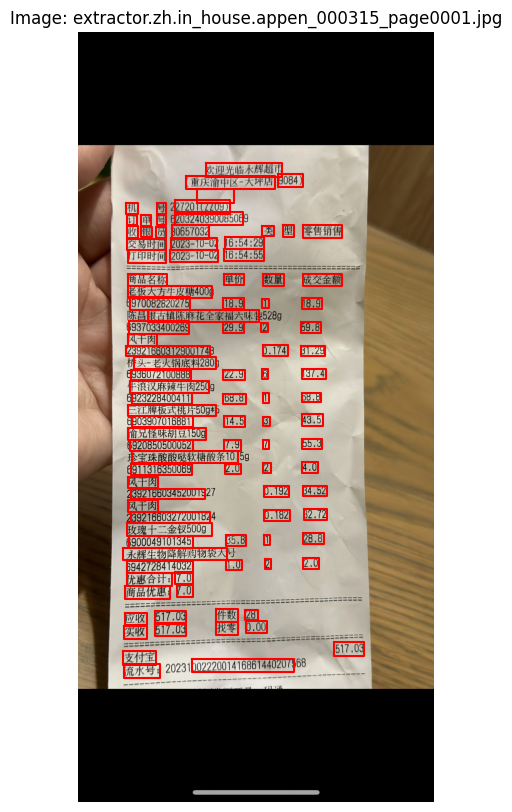
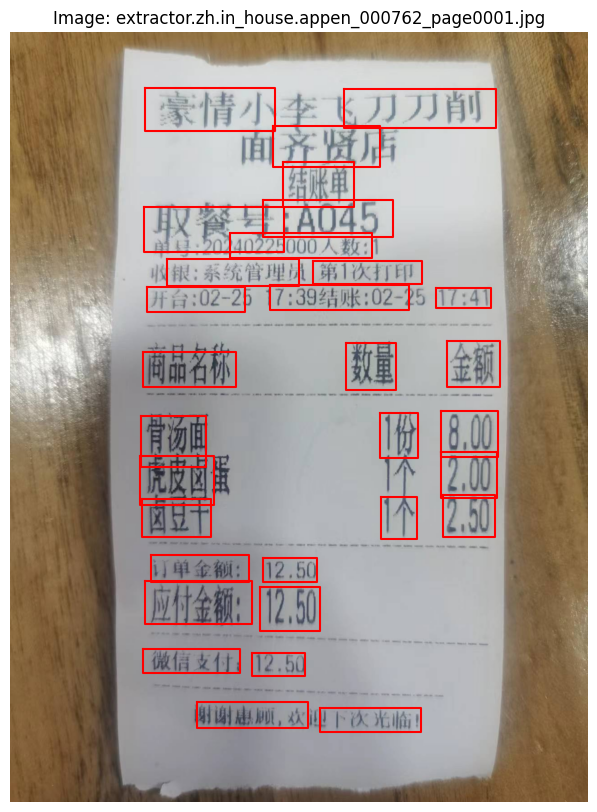
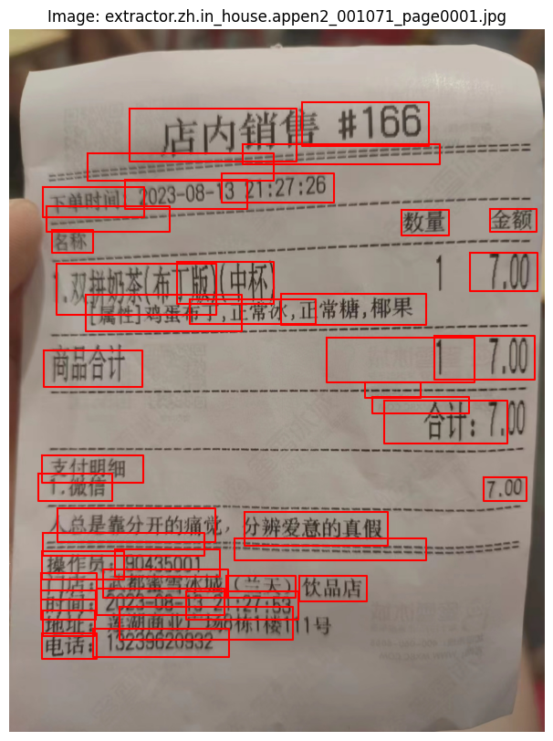
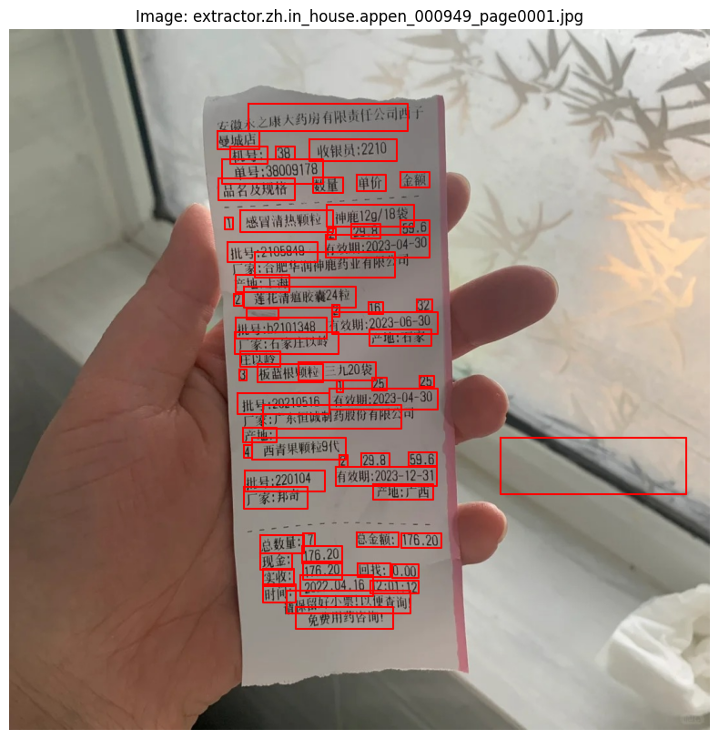
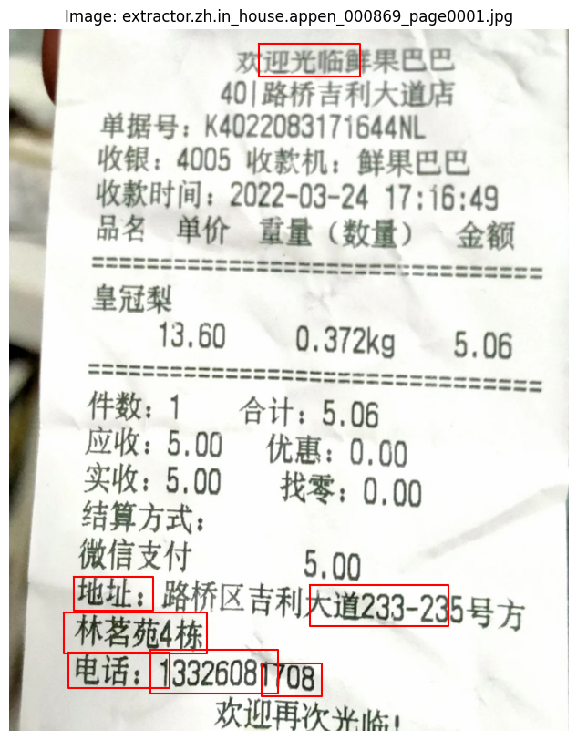
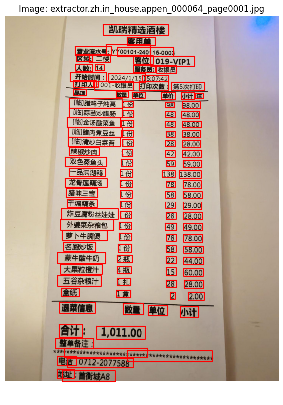

# 다국어 영수증 OCR
본 프로젝트는 다국어 영수증에 대해 OCR(Optical Character Recognition)을 수행하는 작업입니다.  
중국어, 일본어, 태국어, 베트남어로 작성된 영수증 이미지에서 글자 영역을 검출하는 것이 목표입니다.  
OCR은 일반적으로 이미지 내 텍스트를 검출하고 인식까지 수행하는 작업이지만, 본 프로젝트에서는 **글자 검출**까지만 진행했습니다.  
이는 Object Detection과 유사한 방식으로 진행되었습니다.

---

## 실험 및 시도

### 1. 외부 데이터 사용
본 프로젝트는 모델을 고정하고 데이터만 조작하여 성능을 향상시키는 **Data-Centric** 대회였습니다.  
외부 데이터 사용이 가능했기 때문에, **Naver Clova**에서 제공하는 영수증 이미지를 추가 학습 데이터로 사용했습니다.  
이를 통해 F1 점수가 **0.788**에서 **0.8297**로 향상되었습니다.

이후 데이터 양을 더 늘리기 위해 총 3,700여 장의 데이터를 추가 학습시켰으나, 성능이 오히려 하락했습니다.  
추가된 데이터로 인해 **문단 단위로 라벨링된 이미지**가 학습되었을 가능성이 있습니다.  
결과적으로, 검출 박스가 제대로 생성되지 않거나, 하나의 객체에 대해 여러 박스가 생성되는 문제가 발생했습니다.

### 2. 라벨 수정
기본 데이터에 포함된 잘못된 라벨을 수정하여 성능 향상을 시도했습니다.  
영수증 이미지의 텍스트 영역에 대해 Bounding Box(BBox)가 제공되었으나, 일부 박스가 영역을 벗어난 경우가 많았습니다.  
이를 수정하기 위해 다음 과정을 수행했습니다.
 
 
 
 

- **이상치 탐지 방법**:
  - **Z-점수(Z-Score)**: BBox의 좌표 분포를 정규분포로 가정하고, Z-점수가 2 이상인 값을 이상치로 판정.
  - **IQR(Interquartile Range)**: 사분위수를 이용해 이상치를 탐지.
  
- **이상치 처리**:
  - 탐지된 이상치를 제외하고, 대신 가장 가까운 최소/최대 X좌표로 대체.


#### 결과
이상치를 수정하고 학습을 진행했으나, 성능이 향상되지 않고 오히려 하락했습니다.  
이는 모델이 박스를 덜 생성하도록 학습되었기 때문으로 보입니다.  
평가 지표가 **IOU(Intersection Over Union)** 기반으로 계산되기 때문에, 박스를 많이 생성하는 경우 점수가 높아질 수 있다는 점을 고려해야 했습니다.

아래 이미지는 이상치 수정 후 학습 결과입니다.

  
문단을 나누는 구분선을 잘 인식하지 못한 결과입니다.

  
박스끼리 겹치는 경우도 자주 발생했습니다.

---

### 3. Line Crop
#### 문제 인식
영수증 내 문단 구분선(예: "———————", "********")을 잘 검출하지 못하는 경우가 많았습니다.  
이 문제를 해결하기 위해, 문단 구분선을 Crop하여 추가 학습 데이터를 생성하고자 했습니다.

#### 해결 방안
- **Crop 데이터 생성**:
  - "빈 transcription 필드"를 가진 문단 구분선을 탐지하여 이미지에서 잘라내는 함수를 작성.
  - Crop된 데이터를 기존 이미지에 무작위로 배치하여 증강.

```python
def get_separator_lines(self, annotation, img):
    """빈 transcription 필드를 가진 분리선을 크롭하여 반환하는 함수"""
    line_crops = []
    for word_info in annotation['words'].values():
        if word_info['transcription'] == "":
            points = np.array(word_info['points'])
            x_min, y_min = points.min(axis=0)
            x_max, y_max = points.max(axis=0)
            crop = img[int(y_min):int(y_max), int(x_min):int(x_max)]
            line_crops.append(crop)
    return line_crops

def add_lines_to_image(self, img, line_crops, num_copies=5):
    """이미지에 분리선을 무작위로 배치하여 증강하는 함수"""
    h, w = img.shape[:2]
    augmented_img = img.copy()

    for line_crop in line_crops:
        for _ in range(num_copies):
            line_h, line_w = line_crop.shape[:2]
            x_offset = random.randint(0, w - line_w)
            y_offset = random.randint(0, h - line_h)
            augmented_img[y_offset:y_offset + line_h, x_offset:x_offset + line_w] = line_crop

    return augmented_img
```
#### 결과
학습 결과는 다음과 같은 문제가 있었습니다.
  

구분선을 여전히 잘 검출하지 못했습니다.
  

문장에 여러 박스가 생성되는 문제가 있었습니다.
  

이미지 외부에서도 불필요한 박스가 생성되었습니다.
  

일부 특정 패턴(예: "******")은 비교적 잘 검출했으나 완벽하지는 않았습니다.

F1 점수는 Baseline보다 낮은 결과를 보였습니다.

## 회고 및 개선점
### 양질의 데이터 중요성:

학습 데이터의 품질과 라벨링 정확성이 중요하다는 것을 깨달았습니다.
데이터 양을 무작정 늘리는 것보다, 데이터 품질을 우선적으로 고려해야 합니다.

### 평가 지표 이해의 중요성:

평가 지표(IOU 기반)를 고려하여 학습 전략을 조정해야 했습니다.
박스 생성 빈도가 점수에 영향을 미칠 수 있음을 인지했습니다.
실험 과정의 성장:

비록 모든 실험이 성공적이지는 않았지만, 프로젝트 전반을 주도하며 실험을 설계하고 진행하는 경험을 쌓을 수 있었습니다.
