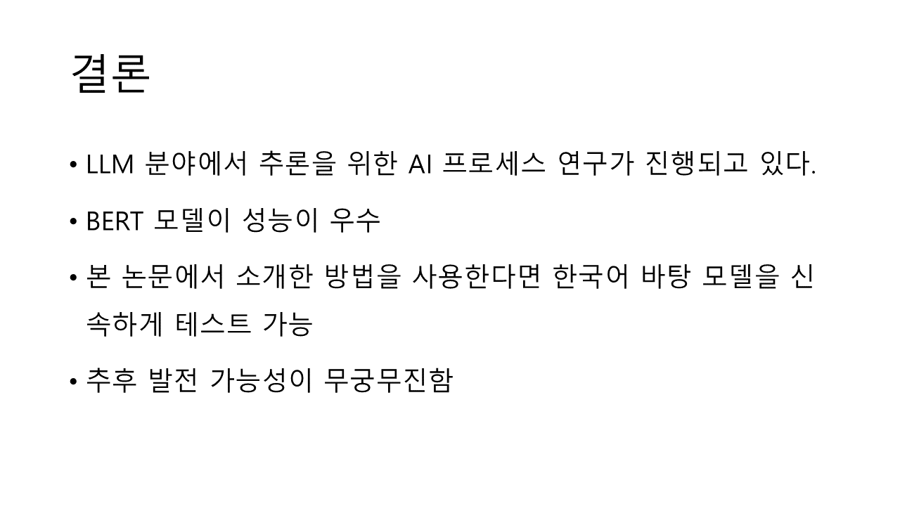

# 세번째 날!

제가 뭐하고 있는지도 안 말하고 첫번째, 두번째 날 했네요...ㅎ

저는 네이버 커넥트에서 진행하는 Boost course를 듣고 있고 CV트랙을 듣고 있습니다.

지금은 PyTorch 문법 열심히 배우고 있습니다.

오늘까지 해야되는 과제를 다 못해서 개운치는 않네요

그래도 팀원들 앞에서 논문발표 하나 했습니다.

[한글 텍스트 감정 이진 분류 모델 생성을 위한 미세 조정과 전이학습에 관한 연구](https://scienceon.kisti.re.kr/srch/selectPORSrchArticle.do?cn=JAKO202331440016936)

위 논문인데 평소의 논문을 잘 읽을 일이 없기도 하고 AI 관련 지식이 부족하다 보니 읽기만 해도 벅찼는데 

발표자료까지 준비하니 힘들긴 했습니다만

차차 익숙해지면 트렌드도 잘 읽을 수 있지 않을까 생각합니다.

---
제가 했던 발표를 다시 보여드리고자 합니다.

# 이진분류 논문 리뷰

제가 발표할 주제는 이진분류였는데 저희는 CV트랙에 해당했지만 주제가 흥미로워보여 본 논문을 리뷰하기로 결정했습니다.

우선 본 논문을 요약하자면 생성형 모델이 크게 유행하고 본 저자도 다국어 번역기 모델을 이용하여 한글 문장을 긍정 또는 부정으로 분류하는 모델로 미세조정 및 전이학습을 진행하였습니다.

그전에 앞서 각 모델마다 성능 분석을 하는 연구를 진행하였습니다.

본 그래프는 Colab 기본 모델의 정확도와 손실 그래프입니다.
그래프에서, 학습데이터의 정확도와 손실은 학습 횟수를 거듭할수록 향상되지만, 테스트 데이터셋을 이용한 검증에서는, 대략 15회 학습 전 후로는 크게 성능향상을 보이지 않는다는 것을 확인할 수 있습니다.
여기에서 F1 Score는 데이터 불균형 문제에서 사용되는 평가 지표입니다.
예를 들자면 10개의 ox 문제에서 정답이 9개가 o인데 모델이 전부 o라고 구분했다면 정확도는 0.9이지만 좋은 모델이라고 보기 어렵습니다.
그렇기에 F1 Score는 클래스의 비중을 반영한 지표라고 볼 수 있습니다.

일반 RNN모델은 단방향으로 진행되어 문장 끝을 사용하지 못합니다.
그러나 일반 RNN 모델과 달리 양방향 RNN모델은 독립된 RNN이 양방향으로 입력을 받고 양방향으로 출력을 합니다.
다시 말하자면 문장을 정방향으로 입력받는 정방향 RNN과 역방향 RNN이 입력을 받아 출력을 결합합니다.
고로 문장의 끝부분까지도 사용가능하지만 이전 모델과 비교해 정확도, 손실, F1점수등 크게 좋아지지는 않았습니다.

BERT는 트랜스포머 아키텍처를 기반으로 합니다. 트랜스포머는 주목(attention) 메커니즘을 사용하여 입력 시퀀스의 모든 요소 간의 관계를 학습합니다.
AdamW 최적화 기법을 사용하고 정확도, 손실, F1 점수 모두 이전 모델들 보다 좋은 결과를 내놓았음
이처럼 BERT 모델이 텍스트 분류에는 적합하고 높은 성능을 보여줌, 고로 논문작성자는 해당 모델을 골랐음

